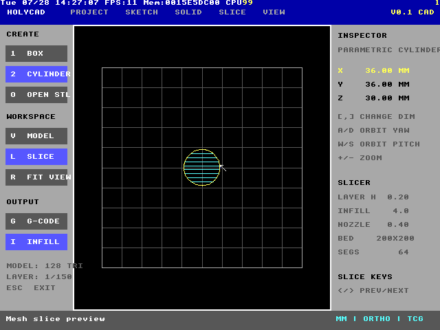
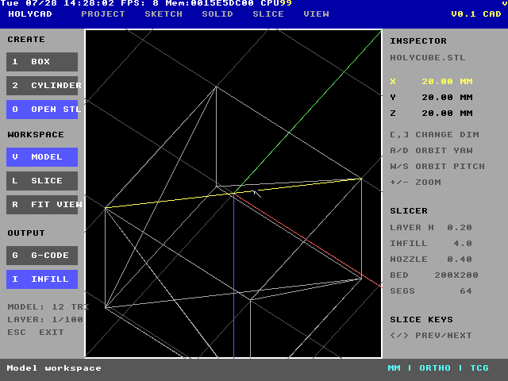

# HolyCAD

HolyCAD is an experimental CAD-style workspace, low-poly model viewer, and
mesh slicer written in native HolyC for TempleOS.

It is deliberately built around TempleOS constraints: a 640x480 interface,
single-task drawing callback, direct keyboard and mouse input, and no external
graphics or geometry libraries.


## What works

- CAD-style docked workspace with a viewport, creation tools, inspector,
  slicer settings, status bar, and model/slice workspaces
- Parametric boxes and 32-sided cylinders
- Editable X, Y, and Z dimensions
- Orthographic 3D wireframe viewing with grid and RGB axes
- Keyboard orbit, mouse-drag orbit, zoom, and fit/reset
- ASCII STL import and automatic centering
- Real triangle/Z-plane intersection slicing
- 200x200 mm print-bed preview
- Alternating horizontal and vertical clipped infill previews
- Layer-by-layer navigation at 0.20 mm
- Educational perimeter G-code generation
- Startup geometry self-tests




## Files

| File | Purpose |
| --- | --- |
| `HolyCAD.HC` | HolyC source |
| `HolyCube.STL` | 20 mm ASCII STL test model |
| `HolyCADShare.img.gz` | Compact distributable transfer disk |
| `HolyCADShare.img` | Unpacked local QEMU disk, ignored by Git |
| `run.command` | macOS QEMU launcher |
| `run.ps1` | Windows QEMU launcher |
| `screenshots/` | Native TempleOS/QEMU test evidence |

Both launchers automatically unpack `HolyCADShare.img.gz` when the local
`HolyCADShare.img` is absent.

## Start on macOS

Requirements:

- QEMU with `qemu-system-x86_64`
- `TempleOS.ISO` in the directory above `HolyCAD`
- `HolyCADShare.img.gz` from the repository

From Terminal:

```sh
cd HolyCAD
chmod +x run.command
./run.command
```

The launcher uses QEMU's Cocoa display, so HolyCAD runs in a normal window.

## Start on Windows

Requirements:

- QEMU for Windows
- `TempleOS.ISO` in the directory above `HolyCAD`
- `HolyCADShare.img.gz` from the repository

If QEMU is on `PATH`, open PowerShell in the `HolyCAD` directory and run:

```powershell
Set-ExecutionPolicy -Scope Process Bypass
.\run.ps1
```

The script also checks the standard `C:\Program Files\qemu` location.

## Start HolyCAD inside TempleOS

On a fresh live-CD boot:

1. Answer `n` to installing TempleOS.
2. Answer `n` to taking the tour.
3. At `T:/Home>`, enter:

   ```c
   Mount;
   ```

4. In the mount wizard:

   - Drive letter: `C`
   - Partition: `1`
   - Press `p` to probe
   - Select device `1`, the primary IDE hard drive
   - Press Enter at the next drive-letter prompt to finish

5. Launch the exact-case filename:

   ```c
   #include "C:/HolyCAD.HC";
   ```

TempleOS filenames are case-sensitive. The program disables the autocomplete
popup while it is open and restores the previous setting when it exits.

## Controls

| Key/input | Action |
| --- | --- |
| `1` | Create/reset parametric box |
| `2` | Create/reset parametric cylinder |
| `O` | Import `C:/HolyCube.STL` |
| `V` | Model workspace |
| `L` | Slice workspace |
| `A` / `D` | Orbit yaw |
| `W` / `S` | Orbit pitch |
| Mouse drag | Orbit the model |
| `+` / `-` | Zoom |
| `R` | Fit and reset view |
| `X`, `Y`, `Z` | Select a dimension |
| `,` / `.` | Decrease/increase selected dimension |
| `<` / `>` | Previous/next slice layer |
| `I` | Toggle infill preview |
| `G` | Export educational G-code |
| `Esc` | Exit HolyCAD |

The left-side buttons can also be clicked.

## G-code output

Pressing `G` writes:

```text
B:/HolyCAD.GCODE
```

`B:` is TempleOS's writable RedSea RAM disk during a live-CD session. The file
is therefore temporary and disappears when the VM shuts down. Confirm it with:

```c
Dir("B:/");
```

On the tested default 40x30x20 mm box, the exporter produced a 58,708-byte
file. The output contains layer comments, absolute positioning, perimeter
moves, extrusion values, and shutdown commands.

This is an educational exporter, not production-ready printer output. It does
not yet chain perimeter segments, emit the displayed infill, generate supports,
or apply a printer/material profile. Review and post-process every file before
using it with hardware.

## Native test results

The current source was compiled and exercised in TempleOS 5.03 under QEMU:

| Test | Result |
| --- | --- |
| HolyC compile and launch | Pass |
| Box generator | 12 triangles |
| Box bounds | 40x30x20 mm |
| Box mid-plane slice | 8 segments |
| Cylinder generator | 128 triangles |
| Cylinder mid-plane slice | 64 segments |
| Layer navigation | Pass |
| Alternating infill preview | Pass |
| ASCII STL import | Pass |
| G-code generation to `B:` | Pass, 58,708 bytes |

The startup geometry test prevents the UI from launching if the box or cylinder
mesh/slice invariants fail.

## Current limits

- Wireframe model rendering; no hidden-line removal or shaded faces yet
- ASCII STL only
- Maximum 768 triangles and 1,536 slice segments
- Orthographic projection only
- One object at a time
- Infill is previewed but not included in exported G-code
- Live-CD exports are temporary

## Best next upgrades

1. Chain raw slice segments into ordered closed contours.
2. Add two or three perimeter shells with proper offsets.
3. Export the clipped infill already shown in the preview.
4. Add shaded faces, face normals, and hidden-line suppression.
5. Add a sketch plane with line/rectangle/circle tools and extrusion.
6. Add object transforms and a small scene/outliner list.
7. Add binary STL and Wavefront OBJ import.
8. Add printer, nozzle, layer-height, speed, and material profiles.
9. Add support detection and support paths.
10. Build a host bridge for importing models and retrieving G-code without
    shutting down the VM.

The most valuable next milestone is contour chaining plus multi-wall and infill
export. That would turn the current geometric slicer preview into a much more
credible end-to-end slicer.
