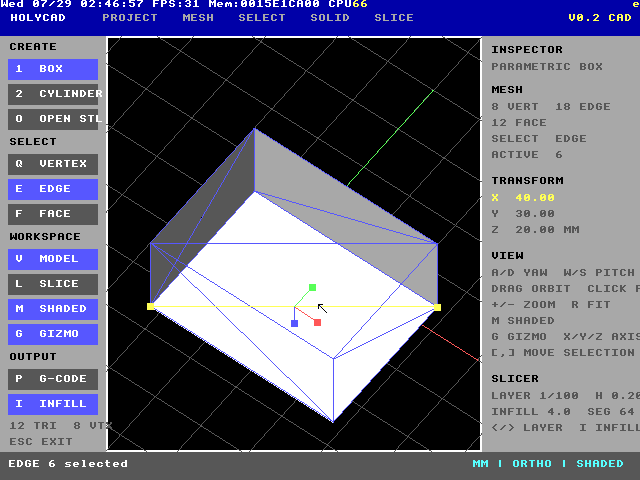
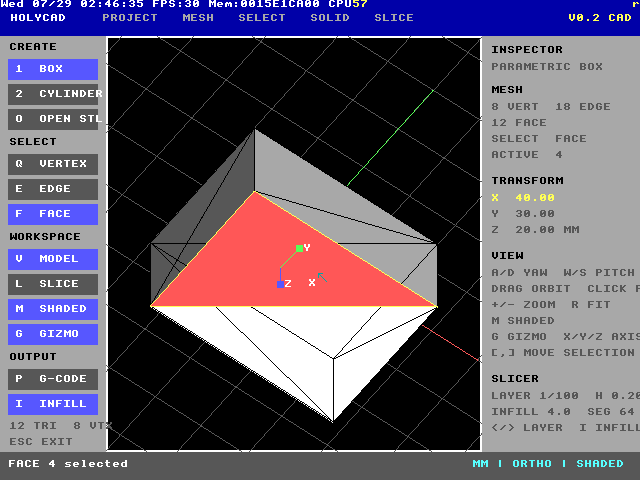

# HolyCAD

HolyCAD is an experimental low-poly mesh editor, CAD-style workspace, and
mesh slicer written in native HolyC for TempleOS. V0.2 pushes it toward a
small, barely-functional Blender: mesh components can be selected and moved,
the viewport can be shaded or wireframe, and selections get an axis gizmo.

It is deliberately built around TempleOS constraints: a 640x480 interface,
single-task drawing callback, direct keyboard and mouse input, and no external
graphics or geometry libraries.


## What works

- CAD-style docked workspace with a viewport, creation tools, inspector,
  slicer settings, status bar, and model/slice workspaces
- Parametric boxes and 32-sided cylinders
- Editable X, Y, and Z dimensions
- Unique-vertex and unique-edge topology derived from triangle meshes
- Click selection modes for vertices, edges, and faces
- Selected-component movement along an active X, Y, or Z axis
- Toggleable RGB transform gizmo at the selected component
- Cycleable orthographic wireframe and basic shaded viewport modes
- Keyboard/arrow-key orbit, mouse-drag orbit, zoom, and fit/reset
- Click-versus-drag handling so a selection click does not disturb the camera
- ASCII STL import and automatic centering
- Real triangle/Z-plane intersection slicing
- 200x200 mm print-bed preview
- Alternating horizontal and vertical clipped infill previews
- Layer-by-layer navigation at 0.20 mm
- Educational perimeter G-code generation
- Startup geometry and topology self-tests






## Files

| File | Purpose |
| --- | --- |
| `HolyCAD.HC` | HolyC source |
| `HolyCube.STL` | 20 mm ASCII STL test model |
| `HolyCADShare.img.gz` | Compact distributable transfer disk |
| `HolyCADShare.img` | Unpacked local QEMU disk, ignored by Git |
| `run.command` | macOS QEMU launcher |
| `run.ps1` | Windows QEMU launcher |
| `screenshots/` | Native TempleOS/QEMU test evidence |

Both launchers automatically unpack `HolyCADShare.img.gz` when the local
`HolyCADShare.img` is absent.

## Start on macOS

Requirements:

- QEMU with `qemu-system-x86_64`
- `TempleOS.ISO` in the directory above `HolyCAD`
- `HolyCADShare.img.gz` from the repository

From Terminal:

```sh
cd HolyCAD
chmod +x run.command
./run.command
```

The launcher uses QEMU's Cocoa display, so HolyCAD runs in a normal window.

## Start on Windows

Requirements:

- QEMU for Windows
- `TempleOS.ISO` in the directory above `HolyCAD`
- `HolyCADShare.img.gz` from the repository

If QEMU is on `PATH`, open PowerShell in the `HolyCAD` directory and run:

```powershell
Set-ExecutionPolicy -Scope Process Bypass
.\run.ps1
```

The script also checks the standard `C:\Program Files\qemu` location.

## Start HolyCAD inside TempleOS

On a fresh live-CD boot:

1. Answer `n` to installing TempleOS.
2. Answer `n` to taking the tour.
3. At `T:/Home>`, enter:

   ```c
   Mount;
   ```

4. In the mount wizard:

   - Drive letter: `C`
   - Partition: `1`
   - Press `p` to probe
   - Select device `1`, the primary IDE hard drive
   - Press Enter at the next drive-letter prompt to finish

5. Launch the exact-case filename:

   ```c
   #include "C:/HolyCAD.HC";
   ```

TempleOS filenames are case-sensitive. The program disables the autocomplete
popup while it is open and restores the previous setting when it exits.

## Controls

| Key/input | Action |
| --- | --- |
| `1` | Create/reset parametric box |
| `2` | Create/reset parametric cylinder |
| `O` | Import `C:/HolyCube.STL` |
| `V` | Model workspace |
| `L` | Slice workspace |
| `Q` | Vertex-selection mode |
| `E` | Edge-selection mode |
| `F` | Face-selection mode |
| `Tab` | Cycle vertex/edge/face selection mode |
| Mouse click | Select the component under the cursor |
| Mouse drag | Orbit the model |
| `A` / `D` or Left/Right | Orbit yaw |
| `W` / `S` or Up/Down | Orbit pitch |
| `+` / `-` | Zoom |
| `R` | Fit and reset view |
| `M` | Cycle wireframe/shaded viewport |
| `G` | Toggle the transform gizmo |
| `X`, `Y`, `Z` | Choose the active transform/dimension axis |
| `,` / `.` | Move the selection -/+ 1 mm; resize when nothing is selected |
| `<` / `>` | Previous/next slice layer |
| `I` | Toggle infill preview |
| `P` | Export educational G-code |
| `Esc` | Exit HolyCAD |

The left-side buttons can also be clicked. Component movement updates every
triangle that shares the selected topology vertex, so connected faces stay
connected. Rebuilding a parametric primitive with `1`, `2`, or a dimension
change intentionally discards component-level edits.

## G-code output

Pressing `P` writes:

```text
B:/HolyCAD.GCODE
```

`B:` is TempleOS's writable RedSea RAM disk during a live-CD session. The file
is therefore temporary and disappears when the VM shuts down. Confirm it with:

```c
Dir("B:/");
```

On the tested default 40x30x20 mm box, the exporter produced a 58,708-byte
file. The output contains layer comments, absolute positioning, perimeter
moves, extrusion values, and shutdown commands.

This is an educational exporter, not production-ready printer output. It does
not yet chain perimeter segments, emit the displayed infill, generate supports,
or apply a printer/material profile. Review and post-process every file before
using it with hardware.

## Native test results

The current source was compiled and exercised in TempleOS 5.03 under QEMU:

| Test | Result |
| --- | --- |
| HolyC compile and launch | Pass |
| Box generator/topology | 8 vertices, 18 edges, 12 faces |
| Box bounds | 40x30x20 mm |
| Box mid-plane slice | 8 segments |
| Cylinder generator/topology | 66 vertices, 192 edges, 128 faces |
| Cylinder mid-plane slice | 64 segments |
| Vertex, edge, and face picking | Pass |
| Shared component movement | Pass |
| Transform gizmo toggle | Pass |
| Wireframe/shaded viewport cycle | Pass |
| Keyboard and mouse orbit | Pass |
| Click selection vs. drag orbit | Pass |
| Layer navigation | Pass |
| Alternating infill preview | Pass |
| ASCII STL import | Pass |
| G-code generation to `B:` | Pass, 58,708 bytes |

The startup geometry test prevents the UI from launching if box/cylinder
geometry, topology, bounds, or slice invariants fail.

## Current limits

- Basic painter-sorted flat shading; no z-buffer, materials, or lighting editor
- ASCII STL only
- Maximum 768 triangles and 1,536 slice segments
- Orthographic projection only
- One object at a time
- One active component selection at a time
- Translation only; the gizmo does not rotate or scale geometry yet
- No undo/redo, saveable scene format, extrusion, or topology creation tools
- Infill is previewed but not included in exported G-code
- Live-CD exports are temporary

## Best next upgrades

1. Make the gizmo interactive with mouse-axis dragging.
2. Add rotate and scale transforms for selected vertices/edges/faces.
3. Add box select, multi-select, delete, and undo/redo.
4. Extrude selected faces and split/subdivide selected edges.
5. Add object mode, a small scene/outliner, and per-object transforms.
6. Add perspective projection and a depth buffer.
7. Add a saveable HolyCAD scene format plus OBJ/binary STL import and export.
8. Add face normals, smooth/flat shading, and backface display options.
9. Chain slice segments into contours and export multi-wall clipped infill.
10. Build a host bridge for moving models and G-code in and out of the VM.

The most valuable modeling milestone is face extrusion plus undo. The most
valuable slicer milestone remains contour chaining with multi-wall and infill
export.
