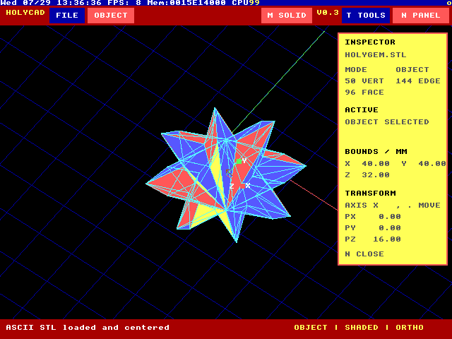
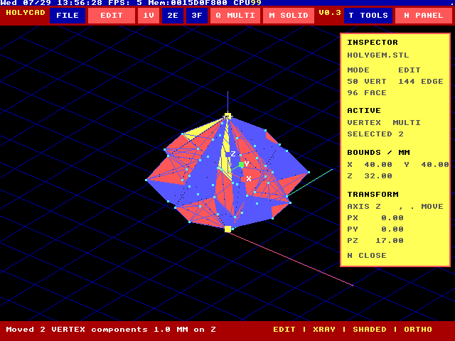
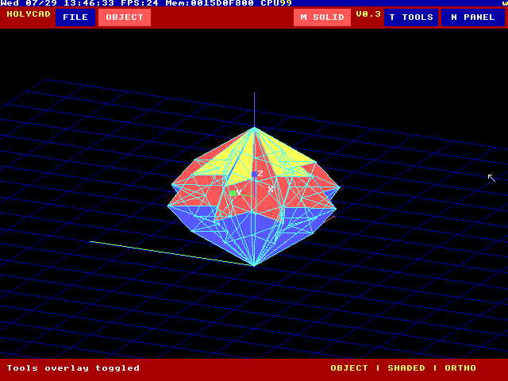
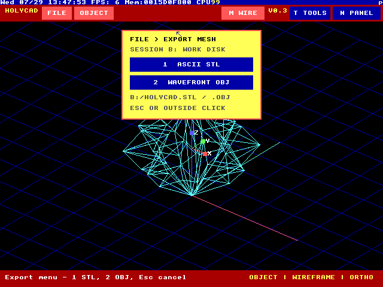
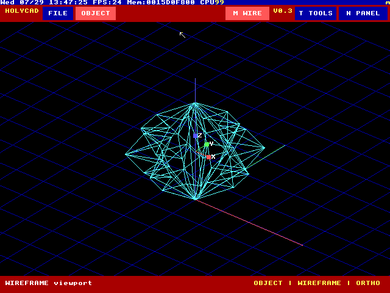

# HolyCAD

A compact Blender-inspired mesh editor written in native HolyC for TempleOS.



## Quick start

Place `TempleOS.ISO` one directory above the `HolyCAD` folder:

```text
TempleOS/
├── TempleOS.ISO
└── HolyCAD/
    ├── HolyCADShare.img.gz
    ├── run.command
    └── run.ps1
```

The launchers unpack the included 64 MB share disk automatically and open
TempleOS in a QEMU window.

### macOS

Install QEMU, then run from the `HolyCAD` directory:

```sh
brew install qemu
chmod +x run.command
./run.command
```

### Windows

Install [QEMU for Windows](https://www.qemu.org/download/#windows), open
PowerShell in the `HolyCAD` directory, and run:

```powershell
Set-ExecutionPolicy -Scope Process Bypass
.\run.ps1
```

The script checks `PATH` and `C:\Program Files\qemu` for QEMU. On either
platform, set `TEMPLEOS_ISO` to use an ISO stored elsewhere.

## Start HolyCAD in TempleOS

On a fresh boot:

1. Answer `n` to installing TempleOS.
2. Answer `n` to taking the tour.
3. At `T:/Home>`, enter:

   ```c
   Mount;
   ```

4. Enter these mount values in order:

   ```text
   Drive letter:     C
   Partition:        1
   Hardware probe:   s (skip)
   IDE base port 0:  0x1f0
   IDE base port 1:  0x3f4
   Unit:             0
   ```

5. Press Enter without a drive letter at the next mount prompt.
6. Launch the exact-case filename:

   ```c
   #include "C:/HolyCAD.HC";
   ```

After exiting, enter `HolyCAD;` to reopen it without compiling the file again.

## Controls

| Input | Action |
| --- | --- |
| `Tab` | Toggle Object Mode / Edit Mode |
| `B` / `C` | Create a box / cylinder |
| `O` | Import `C:/HolyGem.STL` |
| `1` / `2` / `3` | Vertex / edge / face selection |
| `Q` | Toggle component multi-selection |
| Click | Select the object or active component |
| Drag | Orbit the camera |
| `A` / `D`, `W` / `S` | Orbit horizontally / vertically |
| Arrow keys | Orbit the camera |
| `+` / `-` | Zoom |
| `R` | Frame the mesh and reset the view |
| `M` | Toggle shaded / wireframe view |
| `G` | Toggle the transform gizmo |
| `X` / `Y` / `Z` | Choose the movement axis |
| `,` / `.` | Move -/+ 1 mm |
| `T` / `N` | Toggle Tools / Inspector overlays |
| `P` | Open the Export menu |
| `Esc` | Close the menu, or exit HolyCAD |

Object Mode moves the complete mesh. Edit Mode exposes an x-ray topology
overlay for selecting and moving vertices, edges, or faces while retaining the
shaded form beneath it.



Collapse both side panels for an unobstructed viewport:



## Import and export

The bundled import command reads:

```text
C:/HolyGem.STL
```

Press `P` to open the Export menu, then choose:

| Key | Format | Output |
| --- | --- | --- |
| `1` | ASCII STL | `B:/HOLYCAD.STL` |
| `2` | Wavefront OBJ | `B:/HOLYCAD.OBJ` |

Exports include the current object and component edits and remain available
for the current TempleOS session.



Press `M` to switch between basic shaded rendering and the fully open
wireframe view.



## Package contents

| File | Purpose |
| --- | --- |
| `HolyCAD.HC` | HolyC source |
| `DATA/HolyGem.STL` | Bundled ASCII STL demo model |
| `HolyCADShare.img.gz` | Compressed TempleOS share disk |
| `run.command` | macOS QEMU launcher |
| `run.ps1` | Windows QEMU launcher |
| `screenshots/` | Native TempleOS screenshots |
