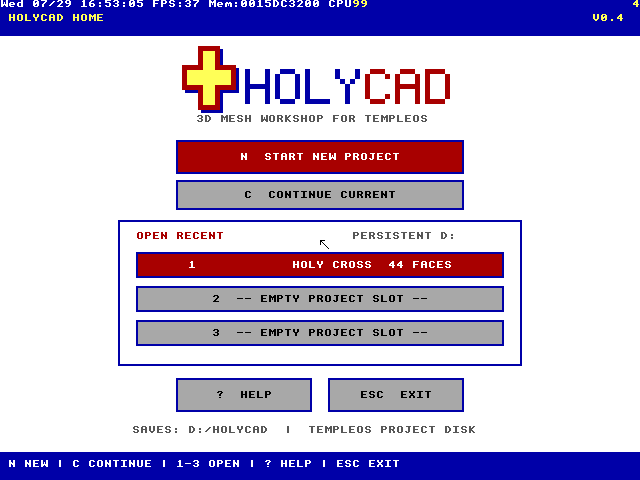
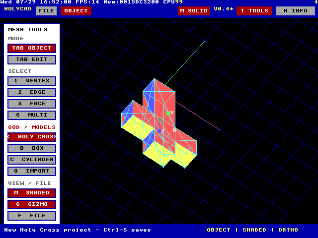
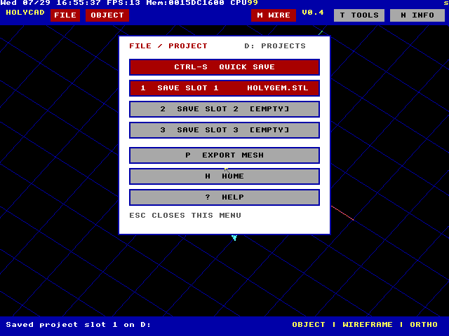
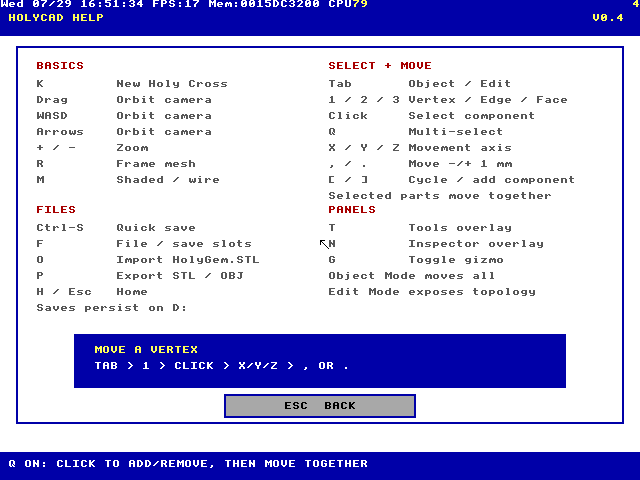

# HolyCAD

A native HolyC mesh editor for TempleOS with object/edit modes, component
selection, persistent projects, model import, and mesh export.


## Quick start

Place `TempleOS.ISO` one directory above the `HolyCAD` folder:

```text
TempleOS/
├── TempleOS.ISO
└── HolyCAD/
    ├── HolyCADShare.img.gz
    ├── HolyCADProjects.img.gz
    ├── run.command
    └── run.ps1
```

Both launchers unpack the bundled disks on first run. The source disk is
refreshed from the bundle when needed; the project disk is reused so saves
survive QEMU restarts.

### macOS

```sh
brew install qemu
chmod +x run.command
./run.command
```

Use an ISO stored elsewhere:

```sh
TEMPLEOS_ISO=/path/to/TempleOS.ISO ./run.command
```

### Windows

Install [QEMU for Windows](https://www.qemu.org/download/#windows), open
PowerShell in the `HolyCAD` directory, then run:

```powershell
Set-ExecutionPolicy -Scope Process Bypass
.\run.ps1
```

For an ISO stored elsewhere:

```powershell
$env:TEMPLEOS_ISO = "C:\path\to\TempleOS.ISO"
.\run.ps1
```

## Launch in TempleOS

On a fresh boot:

1. Answer `n` to installation and `n` to the tour.
2. Enter `Mount;` at `T:/Home>`.
3. Mount the source disk with:

   ```text
   Drive letter:     C
   Partition:        Enter
   Hardware probe:   s
   IDE base port 0:  0x1f0
   IDE base port 1:  0x3f4
   Unit:             0
   ```

4. Press Enter at the next drive-letter prompt.
5. Launch:

   ```c
   #include "C:/HolyCAD.HC";
   ```

HolyCAD mounts its persistent `D:` project disk automatically. After exiting,
enter `HolyCAD;` to reopen it without recompiling.

## Projects



`Start New Project` opens the Holy Cross. `Ctrl-S` saves to the current or
first empty slot. Press `F` to choose one of three slots, then `H` to return
Home and open it from `Open Recent`.



Projects are stored under `D:/HolyCAD`. Each slot alternates between two
verified generations so the previous good save remains available if a write
fails. Back up `HolyCADProjects.img` to back up all projects.



## Controls

| Input | Action |
| --- | --- |
| `Tab` | Object Mode / Edit Mode |
| Click / drag | Select / orbit camera |
| `1` / `2` / `3` | Vertex / edge / face selection |
| `Q` | Toggle multi-selection |
| `[` / `]` | Cycle components; add while multi-select is on |
| `X` / `Y` / `Z` | Choose movement axis |
| `,` / `.` | Move -/+ 1 mm |
| `K` / `B` / `C` | Holy Cross / box / cylinder |
| `O` | Import `C:/HolyGem.STL` |
| `M` | Shaded / wireframe |
| `WASD` / arrows | Orbit camera |
| `+` / `-` / `R` | Zoom / frame mesh |
| `T` / `N` / `G` | Tools / Inspector / gizmo |
| `Ctrl-S` / `F` | Quick save / project menu |
| `H` / `?` | Home / Help |
| `Esc` | Close menu, return Home, then exit |


The Help page includes the complete vertex-movement sequence and the controls
that are not visible in the main viewport.



## Import and export

Press `O` to import the bundled ASCII STL model. Press `P`, then choose:

| Key | Format | Output |
| --- | --- | --- |
| `1` | ASCII STL | `B:/HOLYCAD.STL` |
| `2` | Wavefront OBJ | `B:/HOLYCAD.OBJ` |

Exports include current object and component edits. The `B:` work disk lasts
for the current TempleOS session.


